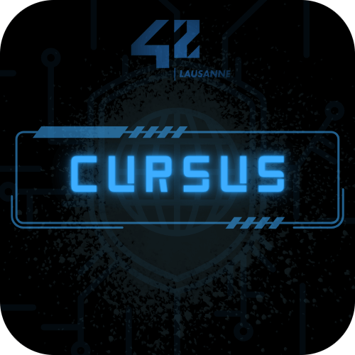
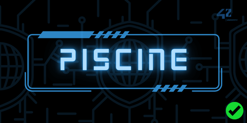
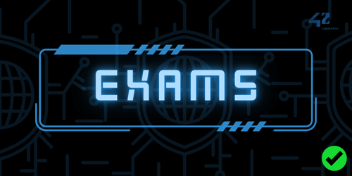
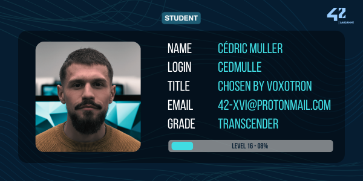

 
  

 

 

---

 

# Hello there !

 

👋 Hello, I'm Cedric.

🚀 Currently immersed in the dynamic world of technology, I'm a passionate learner and enthusiast of all things tech-related.

🎓 I'm currently a student at 42 Lausanne School since October 2023, where I'm actively working on diverse projects that challenge and expand my programming skills.

💡 With a knack for quick learning, adaptability, and resilience under pressure, I thrive in dynamic environments.

🛠️ My goal on GitHub is to share the fruits of my exploration and showcase the projects I'm passionate about.

Feel free to explore and connect. Let's build something amazing together! 💻✨

 

---

 

## Cursus at 42 School - Lausanne

  <table style="width: 75%; margin-left: auto; margin-right: auto;">
    <tr>
      <td style="width: 33%; text-align: center;" align="center">
        
      </td>
      <td style="width: 33%; text-align: center;" align="center">
        
      </td>
      <td style="width: 33%; text-align: center;" align="center">
        
      </td>
    </tr>
    <td style="text-align: center;" align="center" colspan="3" margin-left: auto; margin-right: auto; border-collapse: auto;>
      
        
    </td>
  </table>

	

 

---

 

## Github Stats

 
  

---
