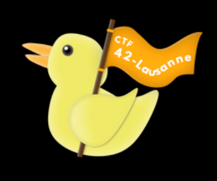

  

  
  

 

---

 

  

---

 

## 42 School Born2Code

  <a href="https://profile.intra.42.fr/users/cedmulle" target="_blank" rel="noopener noreferrer">
    
  </a>

  <a href="https://github.com/aceyzz/42-Piscine"></a>
  <a href="https://github.com/aceyzz/42-Cursus"></a>
  <a href="https://github.com/aceyzz/42-Specs"></a>
  <a href="https://github.com/aceyzz/42-Exam"></a>

 

## 42 Certifications

  <a href="https://42.fr/en/the-program/software-engineer-degree/"></a>
  <a href="https://www.credly.com/org/42/badge/rncp-6-concepteur-developpeur-de-solutions-informat.3"></a>
  <a href="https://www.credly.com/org/42/badge/rncp-niveau-7-expert-en-architecture-informatique-a.3"></a>

 

## Microsoft Azure

  <a href="https://learn.microsoft.com/en-us/credentials/certifications/azure-fundamentals/?practice-assessment-type=certification"></a>
  <a href="https://learn.microsoft.com/en-us/credentials/certifications/azure-data-fundamentals/?practice-assessment-type=certification"></a>
  <a href="https://learn.microsoft.com/fr-fr/credentials/certifications/security-compliance-and-identity-fundamentals/?practice-assessment-type=certification"></a>

## Hackhaton

  
<strong>Click to expand Hackhatons participation details</strong>

 

<table>
  <tr>
    <td width="24%">
      
    </td>
    <td width="24%">
      <strong>Audemars Piguet & Arianee
    </strong> 
      Innovation & Luxury Tech
    </td>
    <td width="24%" align="center">
      Team size: <strong>3</strong> 
      Result: <strong>🥈 2nd place</strong> 
      Type: <strong>Hackathon</strong> 
      Duration: <strong>48h</strong>
    </td>
    <td width="24%" align="center">
      Authors: 
      - <a href="https://github.com/aceyzz">aceyzz</a> 
      - <a href="https://github.com/arnaudherman">arnaudherman</a> 
      - <a href="https://github.com/jrandetdev">jrandetdev</a>
    </td>
  </tr>
</table>

## CTFs

  
<strong>Click to expand CTF participation details</strong>

 

<table>
  <tr>
    <td width="24%">
    <a></a>
  </td>
    <td width="24%" align="center">
    42 lausanne CTF 
    December 2023 
    112 participants 
    73 challenges 
    Average score (1'426 pts) 
    Median score (3'019 pts)
  </td>
  <td width="24%" align="center">
    Pwn - Binary exploitation / OSINT / Web / Forensics / Cryptography / Steganography / Reverse engineering / Privilege escalation / Misc
  </td>
    <td width="24%" align="center">
    My result 
    <strong>4th rank</strong> 
    12'600 pts
  </td>
  </tr>
</table>

## Game Jams

  
<strong>Click to expand Game Jam participation details</strong>

 

<table>
  <tr>
    <td width="24%"></td>
    <td width="24%"></td>
    <td width="24%" align="center">Theme: <strong>CONFINED</strong> Game: <strong>BrickWall</strong> Result: <strong>15/24</strong> Started: <strong>22-03-24</strong> Ended: <strong>24-03-24</strong></td>
    <td width="24%" align="center">Authors: - <a href="https://github.com/Rain36522">Rain36522</a> - <a href="https://github.com/alde-oli">alde-oli</a> - <a href="https://github.com/DavePie">DavePie</a> - <a href="https://github.com/aceyzz">aceyzz</a></td>
  </tr>
</table>

