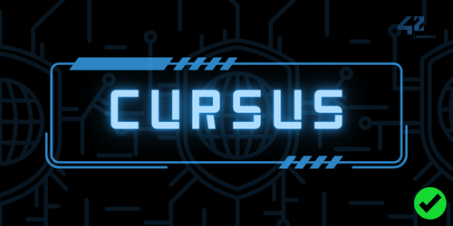

 
  

 

<a href="https://www.linkedin.com/in/cédric-muller-a6787127b" target="_blank" rel="noopener noreferrer">

 

ᴅᴀʀᴋ ᴍᴏᴅᴇ ᴘʟᴇᴀꜱᴇ

 

# Hello there !

 

🚀 Currently immersed in the dynamic world of technology, I'm a passionate learner and enthusiast of all things tech-related.

🎓 I graduated from 42 Lausanne School in October 2024. Currently, I am continuing to specialize in my field. I hold 3 Microsoft Azure certifications in Cloud, Data and Security. My journey is driven by a passion for technology and a commitment to continuous learning and growth.

💼 I'm currently working full-time as a junior IT Engineer.

💡 With a knack for quick learning, adaptability, and resilience under pressure, I thrive in dynamic environments.

🛠️ My goal on GitHub is to share the fruits of my exploration and showcase the projects I'm passionate about.

💻✨Feel free to explore and connect. Let's build something amazing together!

 

 

	<h3>Technologies & Tools</h3>
	 
	<table>
		<tr>
			<td align="center">
			
			</td>
		</tr>
	</table>
	<table>
		<tr>
			<td align="center">
			
			</td>
		</tr>
	</table>

 

## Github Profile Trophy

 

## Cursus at 42 Lausanne School

  <table style="width: 75%; margin-left: auto; margin-right: auto;">
    <tr>
    	<td style="text-align: center;" align="center"margin-left: auto; margin-right: auto; border-collapse: auto;>
        	
        </td>
        <td style="text-align: center;" align="center" margin-left: auto; margin-right: auto; border-collapse: auto;>
        	
        </td>
        <td style="text-align: center;" align="center" margin-left: auto; margin-right: auto; border-collapse: auto;>
        	
      	</td>
	  	<td style="text-align: center;" align="center" margin-left: auto; margin-right: auto; border-collapse: auto;>
        	
		</td>
    </tr>
    	<td style="text-align: center;" align="center" colspan="2" margin-left: auto; margin-right: auto; border-collapse: auto;>
      		
    	</td>
   		<td style="text-align: center;" align="center" margin-left: auto; margin-right: auto; border-collapse: auto;>
	  		
		</td>
		<td style="text-align: center;" align="center" margin-left: auto; margin-right: auto; border-collapse: auto;>
    		
    	</td>
	<tr>
		<td style="text-align: center;" align="center" colspan="4" margin-left: auto; margin-right: auto; border-collapse: auto;>
     		<a href="https://42.fr/en/the-program/software-engineer-degree/">
      	</td>
    </tr>
  </table>

 

## CTFs

<table>
  <tr>
    <td width="24%">
		
	</td>
    <td width="24%" align="center">
		42 lausanne CTF 
		December 2023 
		112 participants 
		73 challenges 
		Average score (1'426 pts) 
		Median score (3'019 pts)
	</td>
	<td width="24%" align="center">
		Pwn - Binary exploitation / OSINT / Web / Forensics / Cryptography / Steganography / Reverse engineering / Privilege escalation / Misc
	</td>
    <td width="24%" align="center">
		My result 
		<strong>4th rank</strong> 
		12'600 pts
	</td>
  </tr>
</table>

 

## Game Jams

<table>
  <tr>
    <td width="24%"></td>
    <td width="24%"></td>
    <td width="24%" align="center">Theme: <strong>CONFINED</strong> Game: <strong>BrickWall</strong> Result: <strong>15/24</strong> Started: <strong>22-03-24</strong> Ended: <strong>24-03-24</strong></td>
    <td width="24%" align="center">Authors: - <a href="https://github.com/Rain36522">Rain36522</a> - <a href="https://github.com/alde-oli">alde-oli</a> - <a href="https://github.com/DavePie">DavePie</a> - <a href="https://github.com/aceyzz">aceyzz</a></td>
  </tr>
</table>

 

## Github Stats
  
<table style="width:50%;justify-content:center;align-item:center;">
	<tr>
		<td style="vertical-align:top;width:100%">
			<picture>
				<source
					srcset="https://github-readme-stats.vercel.app/api?username=aceyzz&theme=vue-dark&show_icons=true&hide_border=true&count_private=true"
					media="(prefers-color-scheme: dark)"
				/>
				<source
					srcset="https://github-readme-stats.vercel.app/api?username=aceyzz&show_icons=true&hide_border=true&count_private=true"
					media="(prefers-color-scheme: light), (prefers-color-scheme: no-preference)"
				/>
				
			</picture>
		</td>
    </tr>
    <tr>
		<td style="vertical-align:top;justify-content:center;align-item:center;height:100%">
			<picture>
				<source
					srcset="https://github-readme-stats.vercel.app/api/top-langs/?username=aceyzz&theme=vue-dark&show_icons=true&hide_border=true&layout=compact"
					media="(prefers-color-scheme: dark)"
				/>
				<source
					srcset="https://github-readme-stats.vercel.app/api/top-langs/?username=aceyzz&show_icons=true&hide_border=true&layout=compact"
					media="(prefers-color-scheme: light), (prefers-color-scheme: no-preference)"
				/>
				
			</picture>
		</td>
    </tr>
    <tr>
		<td style="vertical-align:top;width:100%">
			<picture>
				<source
					srcset="https://github-readme-streak-stats.herokuapp.com/?user=aceyzz&theme=vue-dark&hide_border=true"
					media="(prefers-color-scheme: dark)"
				/>
				<source
					srcset="https://github-readme-streak-stats.herokuapp.com/?user=aceyzz&hide_border=true"
					media="(prefers-color-scheme: light), (prefers-color-scheme: no-preference)"
				/>
				
			</picture>
		</td>
	</tr>
</table>
